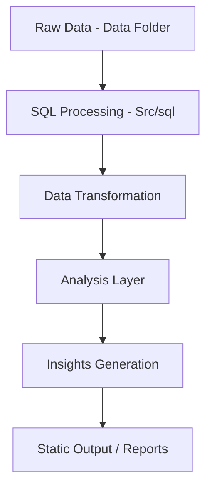

# Pizza Sales Business Analysis (SQL Project)

## Overview
This project analyzes pizza sales data using SQL to generate business insights like revenue trends, product performance, and category contribution.

## Project Structure
```
D:\SQL_pizza_sales_Data
├── Data        # Raw dataset files
├── Src
│   └── sql     # SQL scripts for analysis
└── Static      # Images / documentation / outputs
```

## Architecture (Mermaid)


## Key Features
- Monthly revenue calculation  
- Month-over-month revenue change using LAG()  
- Category-wise revenue analysis  
- Product classification using percentiles (Top / Average / Worst)

## SQL Concepts Used
- Joins  
- CTEs (WITH clause)  
- Window Functions (LAG)  
- Aggregations (SUM)  
- Percentile Functions  

## Outcome
- Identified revenue trends (increase/decrease)  
- Found top-performing and low-performing products  
- Derived actionable business insights  

## Future Improvements
- Dashboard integration (Power BI / Tableau)  
- Automate ETL pipeline  
- Add customer-level analytics  
